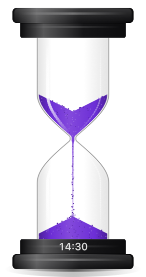

# Sand Timer

A sand timer that sits on your Mac's desktop, above your other windows. Click it to
start, and watch the sand run.

  

## Get it

1. Download **SandTimer-1.0.0.dmg** from the [latest release](https://github.com/and/sand-timer/releases/latest).
2. Open it and drag **Sand Timer** into **Applications**.
3. Open it from Applications. No security warning, no setup, no account.

Works on macOS 13 Ventura or later, on both Apple Silicon and Intel Macs.

The timer has no window of its own and no icon in the Dock — it simply appears on your
desktop, sitting above whatever you are working in.

## Using it

- **Click** it to start. Click again to pause — it tips onto its side — and once more
  to carry on.
- **Drag** it wherever you like. Let go and it drops to the bottom of the screen.
- **Right-click** for everything else: how long to run (1 to 60 minutes, including a
  25-minute 🍅 Pomodoro), the colour of the sand, the style of the base, how big it is,
  whether it makes sounds, whether it starts when you log in, and whether it hides in
  the menu bar.

When the time is up it chimes. If you would rather keep it out of the way, hide it to
the menu bar and the time left shows up there instead, where you can pause and resume it.

## What it does

The sand behaves like sand. A crater deepens in the top as it drains, a pile builds up
underneath, and the stream loosens as it falls. A short timer gets a narrow neck and a
long one gets a wider neck, so the sand always finishes when it should.

Pick it up and drop it, shake it, or knock it over, and the sand reacts the way you
would expect. Flip it and the display in the base turns over with it.

The sounds were made to match what you are seeing: sand landing on glass at first, then
on sand as the pile grows, a rattle while you shake it, and a chime at the end.

  
  

---

Building from source: see [BUILDING.md](BUILDING.md).
