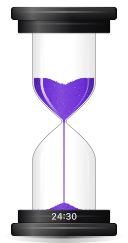
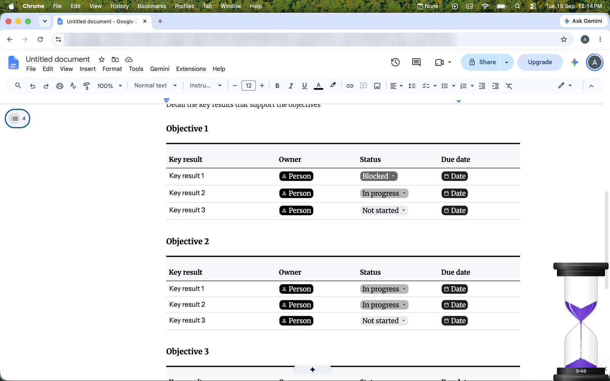
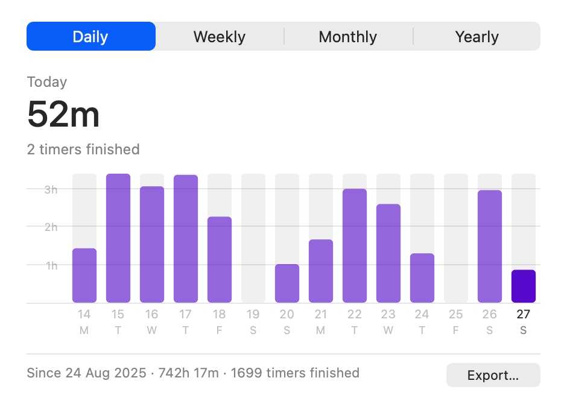
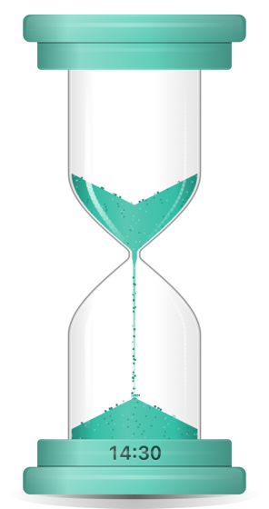
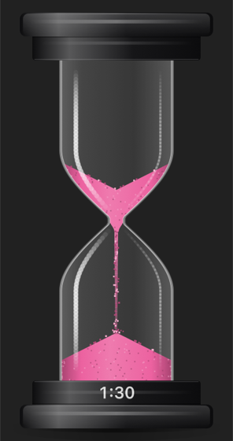

# Sand Timer

A sand timer that sits on your Mac's desktop, above your other windows. Click it to
start, and watch the sand run.

<p align="center">
  
</p>

## Get it

1. Download the **.dmg** from the [latest release](https://github.com/and/sand-timer/releases/latest).
2. Open it and drag **Sand Timer** into **Applications**.
3. Open it from Applications. No security warning, no setup, no account.

Works on macOS 13 Ventura or later, on both Apple Silicon and Intel Macs.

The timer has no window of its own and no icon in the Dock — it simply appears on your
desktop, sitting above whatever you are working in.

<p align="center">
  
</p>

## Using it

- **Click** it to start. Click again to pause — it tips onto its side — and once more
  to carry on.
- **Done early?** **End Session** in the right-click menu keeps the time you ran (it just
  doesn't count as a finished timer), lets the sand settle to the bottom, and leaves the
  timer ready for the next one.
- **Drag** it wherever you like. Let go and it drops to the bottom of the screen.
- **Push the top** sideways to tilt it, the way you would nudge a real one. Let go and it
  rocks back upright; push too far and it topples over and pauses. Lift a toppled timer
  back up by its top, or pull the top upward to pick it up.
- **Right-click** for everything else: how long to run (1 to 60 minutes, including a
  25-minute 🍅 Pomodoro and 6- and 12-minute blocks for billing time), the **Project**,
  **Appearance** for the colour of the sand, the style of the base and how big it is, the
  sounds (including an optional gentle chime each minute), **Statistics…**,
  **Settings…**, and hiding it in the menu bar.

Quit it, restart your Mac, or update it, and it picks up where it left off: a session
that was running carries on, a paused one stays paused, and it comes back at the size you
chose.

### A daily target

Set one in **Settings…**, in minutes or hours, and a groove along the timer's base fills
with sand as the day's time runs — marked at round amounts of time, like each hour of a
three-hour target, and glowing softly once you reach it. Rest the pointer on the base and
the line gives way to the figure, printed in the plastic like the time above it:
`1:18:42/3:00:00`. With the timer hidden in the menu bar, the figure shows there beside
the time left.

### Projects

Make projects in **Settings…**, each with a name and any colour, and the time you run is
counted against whichever one is on. The sand takes the project's colour, and its name is
printed faintly on the top cap, brightening when you hover over the timer, so the time
stays the thing you look at.

- **Switch** from **Project** in the right-click menu (or the menu bar), or **shake the
  timer** side to side to move on to the next project ticked for **Shake**.
- **One Thing at a Time**, on to begin with, keeps the project for the whole session, so
  you aren't tempted to hop between things mid-flow. During a session the projects in the
  menu wait, and shaking does nothing; choose **End Session** (it's right there in the
  Project menu) when you're ready, then pick the next one.
- Time is kept against the project itself, not its name or colour, so renaming or
  recolouring one never disturbs its history, and removing one keeps its time in
  Statistics.

### Statistics

**Statistics…** keeps a tally: how long the sand ran and how many timers you finished,
hour by hour, day by day, week by week, month by month and year by year. Hover a bar to
read it off. Once you use projects, each bar is split by project in their colours, with a
legend, a breakdown of the span you're looking at, and a menu to narrow the chart to one
project. It counts only time the sand was actually running, and it never leaves your Mac —
unless you ask it to: **Export…** saves the whole record as a CSV file, grouped the way
you are looking at it, with a column for each project, for a spreadsheet or a timesheet.

<p align="center">
  
</p>

### Settings

Besides the target and the projects, **Settings…** holds the switches: whether the timer
starts when you log in, whether it stays where you drop it or falls to the bottom of the
screen (**Float Anywhere**), whether Claude and Shortcuts may work it, and whether it
checks for updates. Changes take effect straight away.

The app checks once a day whether a newer version has been released, and if there is one
the menu offers it — it only ever opens the release page in your browser, and downloads
and installs nothing by itself. **Check for Updates** in Settings turns that off, and with
it off the app makes no network calls at all. The offer sits at the foot of the menu,
beside the line that says which version you are running.

When the time is up it chimes. If you would rather keep it out of the way, hide it to
the menu bar and the time left shows up there instead, where you can pause, resume and
restart it and change the sounds. It carries on as it was, sounds and all: what you hear
follows the menu, not whether the timer is on screen.

The sound of the falling sand is off to begin with; turn it up under **Sand Sounds** in
the menu whenever you want to hear it.

## What it does

The sand behaves like sand. A crater deepens in the top as it drains, a pile builds up
underneath, and the stream loosens as it falls. A short timer gets a wide neck and a
thick stream, and a long one a narrow neck and a fine trickle, so the sand always
finishes when it should.

Pick it up and drop it, shake it, or knock it over, and the sand reacts the way you
would expect. Flip it and the display in the base turns over with it.

The sounds were made to match what you are seeing: sand landing on glass at first, then
on sand as the pile grows, a rattle while you shake it, and a chime at the end.

<p align="center">
  
  
</p>

## Ask Claude about your time

The app ships a small MCP server, so Claude can read the record and answer questions about
it — "how much did I focus this week?", "which days do I actually get deep work done?",
"put September's hours in my invoice". Point Claude at it once.

**Claude Code**, one line:

```sh
claude mcp add sand-timer -- /Applications/SandTimer.app/Contents/MacOS/sand-timer-mcp
```

**Claude Desktop**: open **Settings → Developer → Edit Config**, which opens
`~/Library/Application Support/Claude/claude_desktop_config.json`, and add the timer under
`mcpServers`:

```json
{
  "mcpServers": {
    "sand-timer": {
      "command": "/Applications/SandTimer.app/Contents/MacOS/sand-timer-mcp"
    }
  }
}
```

If the file already has other servers, add `"sand-timer"` beside them rather than replacing
the block — and mind the commas, since Claude Desktop ignores the whole file if the JSON is
invalid. Quit Claude Desktop and open it again; the timer then appears in the tools menu.

It reads what the Statistics window shows — time run and timers finished, by hour, day,
week, month or year, split by project when you use them, plus the same CSV the Export
button writes — and it can tell you what the timer is doing right now, and for which
project. It makes no network calls and nothing is uploaded. Nothing runs
until Claude asks it something.

Claude can also work the timer for you — "start a 20 minute timer", "pause it", "end the session" — but only
once you allow it: turn on **Control from Claude & Shortcuts** in Settings. It
is off to begin with, and turning it off again stops the app listening. With it on, the
timer answers `sandtimer://` links, so Shortcuts, a script or `open sandtimer://start?minutes=25`
in a terminal can start, pause, resume, restart and end a session too (`sandtimer://end`).

## Support it

Sand Timer is free and open source. If it brightens your desk and you'd like to say
thanks, you can sponsor it on GitHub or buy me a coffee on Ko-fi. It's entirely
optional, and the app will always be free.

<p>
  <a href="https://github.com/sponsors/and"></a>
  &nbsp;
  <a href="https://ko-fi.com/aanand"></a>
</p>

---

Building from source: see [BUILDING.md](BUILDING.md). Released under the [MIT License](LICENSE).
